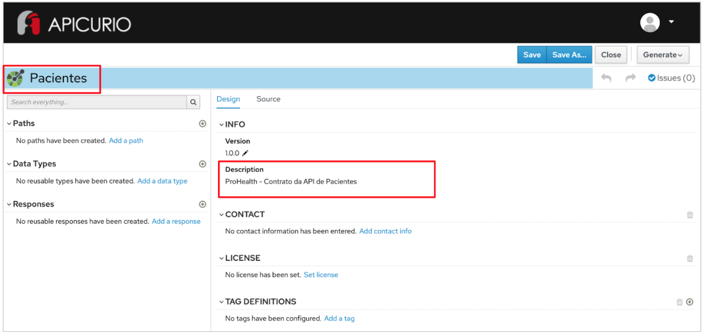

# Exercício - OpenAPI

## Preview do resultado final:

1 - Abra a ferramenta:
https://www.apicur.io/apicurito/

2 - Clique em "Try Live"

3 - Na próxima tela, clique em "Open API"
 
4 - Abra o conteúdo do arquivo [pacientes-openapi-spec.json](pacientes-openapi-spec.json)

5 - A tela apresentada deve corresponder a essa:



## Passo a Passo:

Seguindo o modelo de microserviços, vamos criar um arquivo OpenAPI para o recurso de Pacientes (definido na atividade anterior):

1 - Abra a ferramenta:
https://www.apicur.io/apicurito/

2 - Clique em "Try Live"

3 - Na próxima tela, clique em "New API"

4 - Na tela principal:
* Na parte superior da tela, clique no lápis ao lado da palavra "New API" e digite o nome da entidade de negócio:
````
Pacientes
````

* No lado direito da tela, a partir da seção INFO, clique no valor do campo "Description" e fale do que se trata o seu contrato:
````
ProHealth - Contrato da API de Pacientes
````

* Na seção SERVERS, clique em Add a server
    * No campo Server URL, preencha com: http://localhost:8080 - clique em Apply - clique em Save