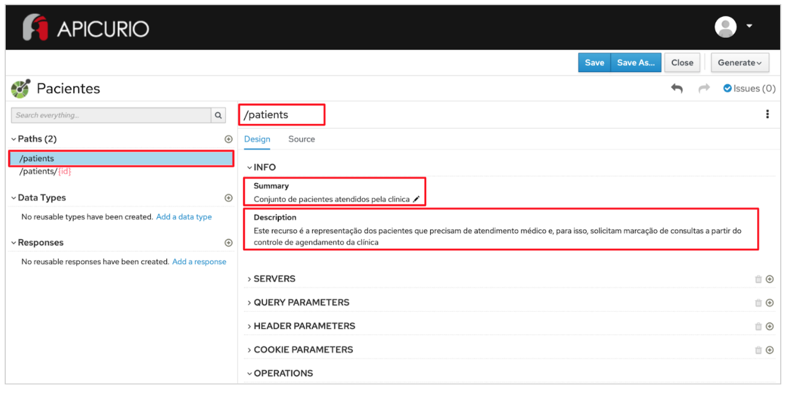
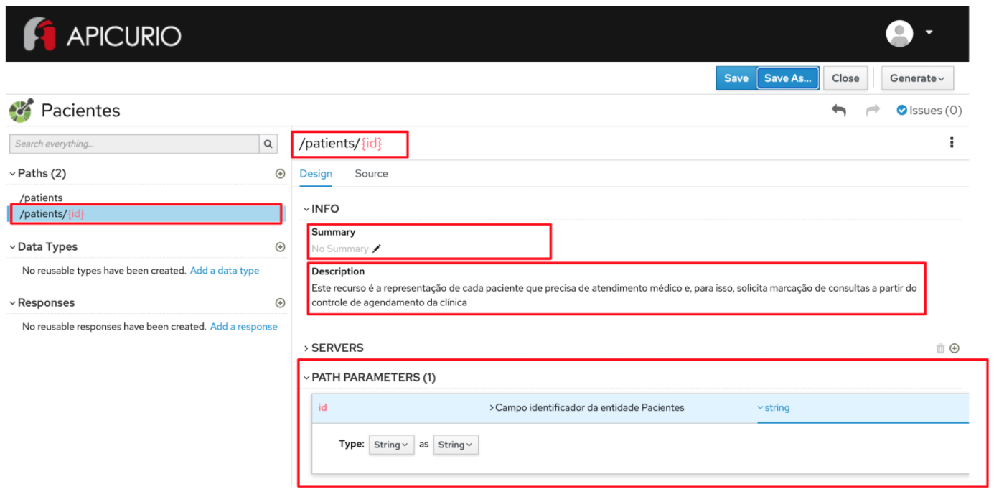

# Exercício - Paths

1 - Abra a ferramenta:
https://www.apicur.io/apicurito/

2 - Clique em "Try Live"

3 - Na próxima tela, clique em "Open API"
 
4 - Abra o conteúdo do arquivo [pacientes-openapi-spec.json](pacientes-openapi-spec.json)

5 - As telas apresentadas devem corresponder a essas:

## Passo a Passo:

A partir do OpenAPI gerado no exercício anterior:

### Etapa 1 - Criação do path para o recurso de coleção da entidade Pacientes

* No lado esquerdo da tela, a partir da seção Paths, clique no botão "+" - no campo que se abre, digite o nome do recurso de coleção: `/patients` - clique no botão Add
* No lado direito da tela, a partir da seção INFO -> Summary, clique no lápis e digite um título para o recurso de coleção. Ex: `Conjunto de pacientes atendidos pela clinica`
* Em INFO -> Description, clique no lápis e digite um título para o recurso. Ex: `Este recurso é a representação dos pacientes que precisam de atendimento médico e, para isso, solicitam marcação de consultas a partir do controle de agendamento da clínica`

### Etapa 2 - Criação do path para o recurso de instância da entidade Pacientes

* No lado esquerdo da tela, a partir da seção Paths, clique no botão "+" - no campo que se abre, digite o nome do recurso de coleção: `/patients/{id}` - clique no botão Add
* No lado direito da tela, a partir da seção INFO -> Summary, clique no lápis e digite um título para o recurso de coleção. Ex: `Informações sobre o paciente atendido pela clinica`
* Em INFO" -> Description, clique no lápis e digite um título para o recurso. Ex: `Este recurso é a representação de cada paciente que precisa de atendimento médico e, para isso, solicita marcação de consultas a partir do controle de agendamento da clínica`
* Em "PATH PARAMETERS", à direita do campo id, clique no botão `+ Create`
* Clique em `No description` e digite no campo Description: `Campo identificador da entidade Pacientes`
* Clique em `No type` e selecione no campo Type: `String as String`