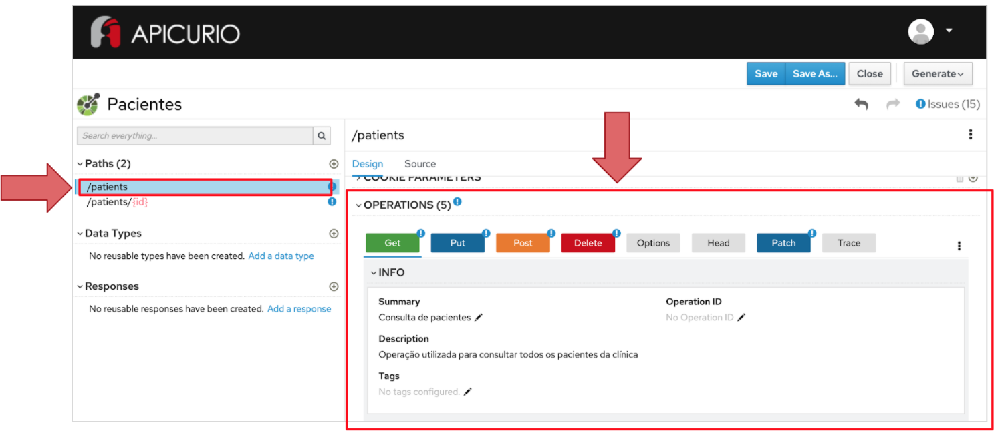
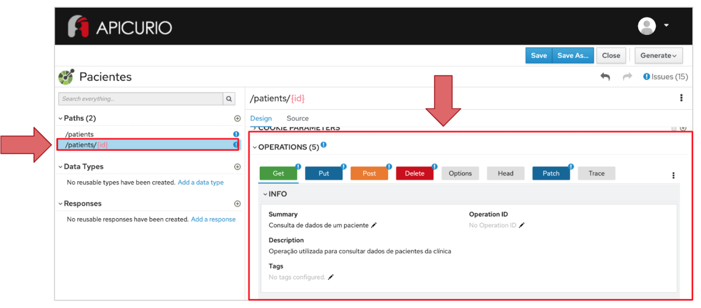

# Exercício - Verbos HTTP

1 - Abra a ferramenta:
https://www.apicur.io/apicurito/

2 - Clique em "Try Live"

3 - Na próxima tela, clique em "Open API"
 
4 - Abra o conteúdo do arquivo [pacientes-openapi-spec.json](pacientes-openapi-spec.json)

5 - As telas apresentadas devem corresponder a essas:





## Passo a Passo:

A partir dos recursos gerados na atividade anterior, utilize os verbos HTTP seguindo o formato CRUD:
* C - Create - POST
* R - Read - GET
* U - Update - PUT e PATCH
* D - Delete - DELETE


### Etapa 1 - Definição de verbos para o recurso de coleção

1.1 - Na parte esquerda da tela, clique no path `/patients`

1.2 -Na parte inferior à direita, clique nos botões:

* Get -> Add Operation

    Preencha os campos:

    Summary: ```Consulta de pacientes```

    Description: ```Operação utilizada para consultar todos os pacientes da clínica```

* Put -> Add Operation

    Preencha os campos:

    Summary: ```Atualização de pacientes```

    Description: ```Operação utilizada para atualizar dados de pacientes da clínica```

* Post -> Add Operation

    Preencha os campos:

    Summary: ```Criação de pacientes```

    Description: ```Operação utilizada para cadastrar novos pacientes da clínica```

* Delete -> Add Operation

    Preencha os campos:

    Summary: ```Remoção de pacientes```

    Description: ```Operação utilizada para apagar pacientes do cadastro da clínica```

* Patch -> Add Operation

    Preencha os campos:

    Summary: ```Atualização de pacientes```

    Description: ```Operação utilizada para atualizar dados de pacientes da clínica```


### Etapa 2 - Definição de verbos para o recurso de instância

2.1 - Na parte esquerda da tela, clique no path `/patients/{id}`

2.2 - Na parte inferior à direita, clique nos botões:

* Get -> Add Operation

    Preencha os campos:

    Summary: ```Consulta de dados de um paciente```

    Description: ```Operação utilizada para consultar dados de pacientes da clínica```

* Put -> Add Operation

    Preencha os campos:

    Summary: ```Atualização de dados de um paciente```

    Description: ```Operação utilizada para atualizar dados de pacientes da clínica```

* Post -> Add Operation

    Preencha os campos:

    Summary: ```Criação de pacientes```

    Description: ```Operação utilizada para cadastrar novos pacientes da clínica```

* Delete -> Add Operation

    Preencha os campos:

    Summary: ```Remoção de pacientes```

    Description: ```Operação utilizada para apagar um paciente do cadastro da clínica```

* Patch -> Add Operation

    Preencha os campos:

    Summary: ```Atualização de dados de um paciente```

    Description: ```Operação utilizada para atualizar dados de pacientes da clínica```


Obs 1: Perceba que todas as operações criadas ficaram marcadas com um sinal de exclamação. Isso se deve porque elas ainda estão incompletas pela falta dos campos que irão compor o bodies de request e response - nós vamos fazer isso na próxima atividade.