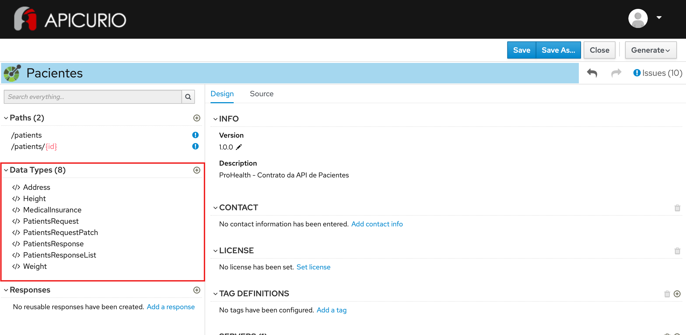

# Exercício - Data Types

## Preview do resultado final:

1 - Abra a ferramenta:
https://www.apicur.io/apicurito/

2 - Clique em "Try Live"

3 - Na próxima tela, clique em "Open API"
 
4 - Abra o conteúdo do arquivo [pacientes-openapi-spec.json](pacientes-openapi-spec.json)

5 - As telas apresentadas devem corresponder a essas:



## Passo a Passo:

A partir do OpenAPI gerado no exercício anterior:

### Etapa 1 - Criação do Data Type Height

Na parte à esquerda da tela, na seção Data Types, clique em `Add a data type`
* Em 1. Enter Basic Information, preencha no campo Name: `Height`
* Em description, preencha: `Objeto que representa a altura de uma pessoa`
* Em 2. Enter JSON Example, preencha:
```
{
    "value": 1.78,
    "unit": "m"
}
```
* Em 3. Choose to create a REST Resource with the Data Type, mantenha a opção `No Resource`
* Clique no botão `Save`

Na parte à direita da tela, na seção PROPERTIES:
* Repita os passos para cada item da tabela abaixo:
* Preencha os campos Description, Obrigatoriedade e Tipo

Nome | Descrição | Obrigatoriedade | Tipo
------|--------|--------|--------
unit | Unidade de medida da altura | Required | String as String
value | Valor da medida de altura de uma pessoa | Required | Number as Double

* Clique no botão `Save`

### Etapa 2 - Criação do Data Type Weight

Na parte à esquerda da tela, na seção Data Types, clique em `Add a data type`
* Em 1. Enter Basic Information, preencha no campo Name: `Weight`
* Em description, preencha: `Objeto que representa o peso de uma pessoa`
* Em 2. Enter JSON Example, preencha:
```
{
    "value": 1.78,
    "unit": "m"
}
```
* Em 3. Choose to create a REST Resource with the Data Type, mantenha a opção `No Resource`
* Clique no botão `Save`

Na parte à direita da tela, na seção PROPERTIES:
* Repita os passos para cada item da tabela abaixo:
* Preencha os campos Description, Obrigatoriedade e Tipo

Nome | Descrição | Obrigatoriedade | Tipo
------|--------|--------|--------
unit | Unidade de medida do peso | Required | String as String
value | Valor da medida de peso de uma pessoa | Required | Number as Double

* Clique no botão `Save`

### Etapa 3 - Criação do Data Type MedicalInsurance

Na parte à esquerda da tela, na seção Data Types, clique em `Add a data type`
* Em 1. Enter Basic Information, preencha no campo Name: `MedicalInsurance`
* Em description, preencha: `Objeto que representa o plano de saúde de um paciente`
* Em 2. Enter JSON Example, preencha:
```
{
    "id": "324.5231100.3432",
    "operator_code": "AMIL"
}
```
* Em 3. Choose to create a REST Resource with the Data Type, mantenha a opção `No Resource`
* Clique no botão `Save`

Na parte à direita da tela, na seção PROPERTIES:
* Repita os passos para cada item da tabela abaixo:
* Preencha os campos Description, Obrigatoriedade e Tipo

Nome | Descrição | Obrigatoriedade | Tipo
------|--------|--------|--------
id | Código de inscrição do paciente na sua operadora de plano de saúde | Required | String as String
operator_code | Código da operadora de plano de saúde na qual o paciente está inscrito | Required | String as String

* Clique no botão `Save`

### Etapa 4 - Criação do Data Type Address

Na parte à esquerda da tela, na seção Data Types, clique em `Add a data type`
* Em 1. Enter Basic Information, preencha no campo Name: `Address`
* Em description, preencha: `Objeto que representa o endereço residencial do paciente`
* Em 2. Enter JSON Example, preencha:
```
{
    "street": "Rua Luis Gois, 1200",
    "complement": "apto 204",
    "district": "Vila Mariana",
    "city": "São Paulo",
    "state": "SP",
    "zipcode": "04043-050"
}
```
* Em 3. Choose to create a REST Resource with the Data Type, mantenha a opção `No Resource`

Na parte à direita da tela, na seção PROPERTIES:
* Repita os passos para cada item da tabela abaixo:
* Preencha os campos Descriptions, Obrigatoriedade e Tipo

Nome | Descrição | Obrigatoriedade | Tipo
------|--------|--------|--------
city | Nome da cidade | Required | String as String
complement | Complemento do endereço (ex: apartamento, bloco, etc) | Not Required | String as String
district | Nome do bairro | Required | String as String
state | Nome do estado | Required | String as String
street | Nome da rua onde o paciente reside | Required | String as String
zipcode | Código postal - CEP | Required | String as String

* Clique no botão `Save`

### Etapa 5 - Criação do Data Type PatientsResponse

Na parte à esquerda da tela, na seção Data Types, clique em `Add a data type`
* Em 1. Enter Basic Information, preencha no campo Name: `Patient`
* Em description, preencha: `Representa um paciente da clínica - utilizado no response da consulta do objeto de instância`
* Em 2. Enter JSON Example, preencha com:
```
{
    "id": "3dc97efc-1b5b-492c-905c-449677b390e1",
    "name": "Marcio Andrade",
    "cpf": "123.345.789-0",
    "phone_number": "11-91111-4394",
    "birthdate": "2001-08-10",
    "height": {
      "value": 1.78,
      "unit": "m"
    },
    "weight": {
      "value": 80,
      "unit": "kg"
    },
    "smoker": false,
    "comorbidities": ["Cirrose hepática", "Valvopatia"],
    "medical_insurance": {
        "id": "324.5231100.3432",
        "operator_code": "AMIL"
    },
    "address": {
        "street": "Rua Luis Gois, 1200",
        "complement": "apto 204",
        "district": "Vila Mariana",
        "city": "São Paulo",
        "state": "SP",
        "zipcode": "04043-050"
    }
}
```
* Em 3. Choose to create a REST Resource with the Data Type, mantenha a opção `No Resource`

Na parte à direita da tela, na seção PROPERTIES:
* Repita os passos para cada item da tabela abaixo:
* Preencha os campos Description, Obrigatoriedade e Tipo

Nome | Descrição | Obrigatoriedade | Tipo
------|--------|--------|--------
address | Endereço residencial do paciente | Required | Address
birthdate | Data de nascimento do paciente | Required | String as Date
comorbidities | Lista de comorbidades que afetam o paciente (caso tenha) | Not Required | Array of String as String
cpf | Documento de identificação do paciente - CPF | Required | String as String
height | Altura do paciente | Required | Height
id | Código único identificador do paciente | Required | String as String
medical_insurance | Plano de saúde na qual o paciente está inscrito | Not Required | MedicalInsurance
name | Nome completo do paciente | Required | String as String
phone_number | Número de telefone do paciente para contato | Required | String as String
smoker | Indica se o paciente é fumante (true-Sim, false-Não) | Not Required | Boolean
weight | Peso do paciente | Required | Weight

### Etapa 6 - Criação do Data Type PatientsResponseList

Na parte à esquerda da tela, na seção Data Types, clique com o botão direito sobre `PatientsResponse` - em seguida, clique em `Clone`
* No campo Name, preencha com: `PatientsResponseList` - clique no botão clone
* Clique sobre o Data Type recém criado (PatientsResponseList)
* Na parte direita da tela, na seção INFO, altere o campo Description para: `Representa uma lista de pacientes da clínica - utilizado no response da consulta do objeto de coleção`
* Na seção PROPERTIES, remova todos os campos, exceto os campos cpf, id e name
* Na seção EXAMPLE, remova todos os campos, exceto os campos cpf, id e name

### Etapa 7 - Criação do Data Type PatientsRequest

Na parte à esquerda da tela, na seção Data Types, clique com o botão direito sobre `PatientsResponse` - em seguida, clique em `Clone`
* No campo Name, preencha com: `PatientsRequest`
* Clique sobre o Data Type recém criado (PatientsRequest)
* Na parte direita da tela, na seção INFO, altere o campo Description para: `Representa um paciente da clínica - utilizado no request de criação do objeto de instância`
* Na seção PROPERTIES, localize o campo id - clique nas reticências à direita - clique em `Delete`
* Na seção EXAMPLE, localize o campo id e remova-o do JSON.

### Etapa 8 - Criação do Data Type PatientsRequestPatch

Na parte à esquerda da tela, na seção Data Types, clique com o botão direito sobre `PatientsRequest` - em seguida, clique em `Clone`
* No campo Name, preencha com: `PatientsRequestPatch`
* Clique sobre o Data Type recém criado (PatientsRequestPatch)
* Na parte direita da tela, na seção INFO, altere o campo Description para: `Representa um paciente da clínica - utilizado no request de alteração do objeto de instância (específico para operação PATCH)`
* Na seção PROPERTIES, remova a obrigatoriedade de todos os campos

