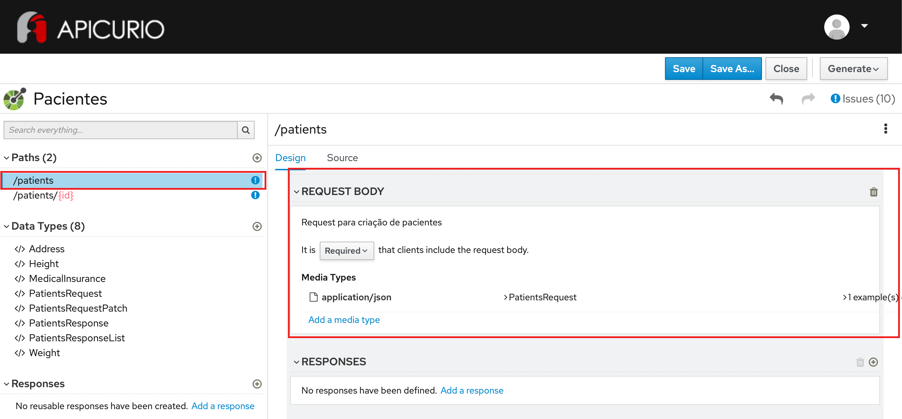
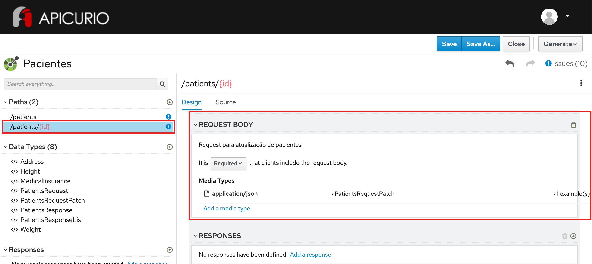

# Configurando Data Types em requests no OpenAPI

## Preview do resultado final:

1 - Abra a ferramenta:
https://www.apicur.io/apicurito/

2 - Clique em "Try Live"

3 - Na próxima tela, clique em "Open API"
 
4 - Abra o conteúdo do arquivo [pacientes-openapi-spec.json](pacientes-openapi-spec.json)

5 - As telas apresentadas devem corresponder a essas:





## Passo a Passo:

A partir do OpenAPI gerado no exercício anterior:

### Etapa 1 - Configuração do corpo do request para POST /patients

* Na parte esquerda da tela, na seção PATHS, clique no path `/patients`
* Na parte direita da tela, certifique-se que a operação POST esteja selecionada
* Na seção REQUEST BODY, clique em `Add a request body`
* No campo Description, preencha: `Request para criação de pacientes`
* Altere o valor do combo abaixo para `Required`
* No campo Media Types, clique em `Add a media type`
* Mantenha a opção `application/json` selecionada e clique em `Add`
* Clique em `No Type` - selecione o Type `PatientsRequest`
* Clique em `No example` - em seguida em `Add a example`
* Preencha o campo `Name` com: `PatientsRequestExample`
```
{
    "name": "Marcio Andrade",
    "cpf": "123.345.789-0",
    "phone_number": "11-91111-4394",
    "birthdate": "2001-08-10",
    "height": {
        "value": 1.78,
        "unit": "m"
    },
    "weight": {
        "value": 80,
        "unit": "kg"
    },
    "smoker": false,
    "comorbidities": [
        "Cirrose hepática",
        "Valvopatia"
    ],
    "medical_insurance": {
        "id": "324.5231100.3432",
        "operator_code": "AMIL"
    },
    "address": {
        "street": "Rua Luis Gois, 1200",
        "complement": "apto 204",
        "district": "Vila Mariana",
        "city": "São Paulo",
        "state": "SP",
        "zipcode": "04043-050"
    }
}
```

### Etapa 2 - Configuração do corpo do request para PUT /patients/{id}

* Na parte esquerda da tela, na seção PATHS, clique no path `/patients/{id}`
* Na parte direita da tela, certifique-se que a operação PUT esteja selecionada
* Na seção REQUEST BODY, clique em `Add a request body`
* No campo Description, preencha: `Request para atualização de pacientes`
* Altere o valor do combo abaixo para `Required`
* No campo Media Types, clique em `Add a media type`
* Mantenha a opção `application/json` selecionada e clique em `Add`
* Clique em `No Type` - selecione o Type `PatientsRequest`
* Clique em `No example` - em seguida em `Add a example`
* Preencha o campo `Name` com: `PatientsRequestExample`
```
{
    "id": "3dc97efc-1b5b-492c-905c-449677b390e1",
    "name": "Marcio Andrade",
    "cpf": "123.345.789-0",
    "phone_number": "11-91111-4394",
    "birthdate": "2001-08-10",
    "height": {
        "value": 1.78,
        "unit": "m"
    },
    "weight": {
        "value": 80,
        "unit": "kg"
    },
    "smoker": false,
    "comorbidities": [
        "Cirrose hepática",
        "Valvopatia"
    ],
    "medical_insurance": {
        "id": "324.5231100.3432",
        "operator_code": "AMIL"
    },
    "address": {
        "street": "Rua Luis Gois, 1200",
        "complement": "apto 204",
        "district": "Vila Mariana",
        "city": "São Paulo",
        "state": "SP",
        "zipcode": "04043-050"
    }
}
```

### Etapa 3 - Configuração do corpo do request para PATCH /patients/{id}

* Na parte esquerda da tela, na seção PATHS, clique no path `/patients/{id}`
* Na parte direita da tela, certifique-se que a operação PATCH esteja selecionada
* Na seção REQUEST BODY, clique em `Add a request body`
* No campo Description, preencha: `Request para atualização de pacientes`
* Altere o valor do combo abaixo para `Required`
* No campo Media Types, clique em `Add a media type`
* Mantenha a opção `application/json` selecionada e clique em `Add`
* Clique em `No Type` - selecione o Type `PatientsRequestPatch`
* Clique em `No example` - em seguida em `Add a example`
* Preencha o campo `Name` com: `PatientsRequestExample`
```
{
    "id": "3dc97efc-1b5b-492c-905c-449677b390e1",
    "name": "Marcio Andrade",
    "cpf": "123.345.789-0",
    "phone_number": "11-91111-4394",
    "birthdate": "2001-08-10",
    "height": {
        "value": 1.78,
        "unit": "m"
    },
    "weight": {
        "value": 80,
        "unit": "kg"
    },
    "smoker": false,
    "comorbidities": [
        "Cirrose hepática",
        "Valvopatia"
    ],
    "medical_insurance": {
        "id": "324.5231100.3432",
        "operator_code": "AMIL"
    },
    "address": {
        "street": "Rua Luis Gois, 1200",
        "complement": "apto 204",
        "district": "Vila Mariana",
        "city": "São Paulo",
        "state": "SP",
        "zipcode": "04043-050"
    }
}
```
