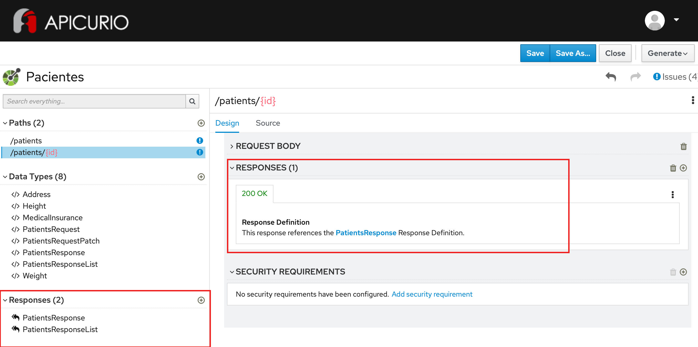

# Exercício - Responses de sucesso

## Preview do resultado final:

1 - Abra a ferramenta:
https://www.apicur.io/apicurito/

2 - Clique em "Try Live"

3 - Na próxima tela, clique em "Open API"
 
4 - Abra o conteúdo do arquivo [pacientes-openapi-spec.json](pacientes-openapi-spec.json)

5 - A tela apresentada deve corresponder a essa:



## Passo a Passo:

A partir do OpenAPI gerado no exercício anterior:

### Etapa 1 - Configuração de responses
* Na parte esquerda da tela, na seção Responses, clique no ícone `+`
* No campo Name, preencha com `PatientsResponse`
* No campo Description, preencha com `Representa um paciente da clínica - utilizado no response da consulta do objeto de instância`
* Clique em Save
* Na tela à esquerda, clique em Add a media type - Mantenha a seleção application/json e clique em Add
* Clique em `No Type` - selecione o Type `PatientsResponse`
* Clique em `No examples defined` - em seguida em `Add a example`    
* Preencha o campo `Name` com: `PatientsResponseExample`
```
{
    "id": "3dc97efc-1b5b-492c-905c-449677b390e1",
    "name": "Marcio Andrade",
    "cpf": "123.345.789-0",
    "phone_number": "11-91111-4394",
    "birthdate": "2001-08-10",
    "height": {
      "value": 1.78,
      "unit": "m"
    },
    "weight": {
      "value": 80,
      "unit": "kg"
    },
    "smoker": false,
    "comorbidities": ["Cirrose hepática", "Valvopatia"],
    "medical_insurance": {
        "id": "324.5231100.3432",
        "operator_code": "AMIL"
    },
    "address": {
        "street": "Rua Luis Gois, 1200",
        "complement": "apto 204",
        "district": "Vila Mariana",
        "city": "São Paulo",
        "state": "SP",
        "zipcode": "04043-050"
    }
}
```

* Na parte esquerda da tela, na seção Responses, clique no ícone `+`
* No campo Name, preencha com `PatientsResponseList`
* No campo Description, preencha com `Representa um paciente da clínica - utilizado no response da consulta do objeto de coleção`
* Clique em Save
* Na tela à esquerda, clique em Add a media type - Mantenha a seleção application/json e clique em Add
* Clique em `No Type` - selecione o Type `Array`of `PatientsResponseList`
* Clique em `No examples defined` - em seguida em `Add a example`    
* Preencha o campo `Name` com: `PatientsResponseListExample`
```
[
    {
        "id": "3dc97efc-1b5b-492c-905c-449677b390e1",
        "name": "Marcio Andrade",
        "cpf": "123.345.789-0"
    },
    {
        "id": "9ed9bf5b-2a3b-4f07-b908-981291d30965",
        "name": "Sarah Gomes Correia",
        "cpf": "788.205.510-71"
    },
    {
        "id": "920d5b83-89a9-4408-bd5d-c978c4eb78e3",
        "name": "Flavio Felipe Inacio",
        "cpf": "737.775.330-76"
    },
    {
        "id": "17d4eae8-ff5e-4081-9ef1-c7d8d4c9c051",
        "name": "Simone Maria dos Santos",
        "cpf": "917.010.320-82"
    },
    {
        "id": "899a8ccf-9a6f-45f1-9277-9326c788378f",
        "name": "Ronaldo de Souza Oliveira",
        "cpf": "772.744.020-56"
    },
    {
        "id": "415bfbb1-4620-44b6-b05c-75c2da38a0db",
        "name": "Rita Vieira da Rosa",
        "cpf": "605.666.270-51"
    },
    {
        "id": "31401738-0d60-47e3-90c7-a296aea6e85b",
        "name": "Juliana Ventura Fernandes",
        "cpf": "361.386.640-43"
    }
]
```

### Etapa 2 - Configuração do response de sucesso para GET /patients

* Na parte esquerda da tela, na seção PATHS, clique no path `/patients`
* Na parte direita da tela, certifique-se que a operação GET esteja selecionada
* Na seção RESPONSES, clique em `Add a response`
* Mantenha o código `200 OK` e clique em `Add`
* No campo Response Definition (optional), selecione `PatientsResponseList` e clique em `Add`

### Etapa 3 - Configuração do response de sucesso para POST /patients

* Na parte esquerda da tela, na seção PATHS, clique no path `/patients`
* Na parte direita da tela, certifique-se que a operação POST esteja selecionada
* Na seção RESPONSES, clique em `Add a response`
* Mantenha o código `201 Created` e clique em `Add`
* No campo Response Definition (optional), selecione `PatientsResponse`  e clique em `Add`


### Etapa 4 - Configuração do response de sucesso para GET /patients/{id}

* Na parte esquerda da tela, na seção PATHS, clique no path `/patients/{id}`
* Na parte direita da tela, certifique-se que a operação GET esteja selecionada
* Na seção RESPONSES, clique em `Add a response`
* Mantenha o código `200 OK`
* No campo Response Definition (optional), selecione `PatientsResponse` e clique em `Add`

### Etapa 5 - Configuração do response de sucesso para PUT /patients/{id}

* Na parte esquerda da tela, na seção PATHS, clique no path `/patients/{id}`
* Na parte direita da tela, certifique-se que a operação PUT esteja selecionada
* Na seção RESPONSES, clique em `Add a response`
* Mantenha o código `200 OK`
* No campo Response Definition (optional), selecione `PatientsResponse`  e clique em `Add`

### Etapa 6 - Configuração do response de sucesso para PATCH /patients/{id}

* Na parte esquerda da tela, na seção PATHS, clique no path `/patients/{id}`
* Na parte direita da tela, certifique-se que a operação PATCH esteja selecionada
* Na seção RESPONSES, clique em `Add a response`
* Mantenha o código `200 OK`
* No campo Response Definition (optional), selecione `PatientsResponse`  e clique em `Add`

### Etapa 7 - Configuração do response de sucesso para DELETE /patients/{id}

* Na parte esquerda da tela, na seção PATHS, clique no path `/patients/{id}`
* Na parte direita da tela, certifique-se que a operação DELETE esteja selecionada
* Na seção RESPONSES, clique em `Add a response`
* Mantenha o código `204 No Content` e clique em `Add`
* No campo Response Definition (optional), não selecionar nenhum valor.
* No campo Description, preencha: `Response para remoção de um paciente`
