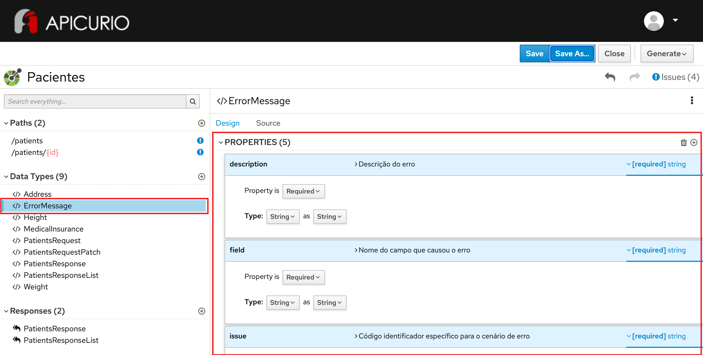

# Exercício - DataType de Erro

## Preview do resultado final:

1 - Abra a ferramenta:
https://www.apicur.io/apicurito/

2 - Clique em "Try Live"

3 - Na próxima tela, clique em "Open API"
 
4 - Abra o conteúdo do arquivo [pacientes-openapi-spec.json](pacientes-openapi-spec.json)

5 - A tela apresentada deve corresponder a essa:



## Passo a Passo:

A partir do OpenAPI gerado no exercício anterior:

### Etapa 1 - Criação de Data Type para mensagens de erro

Na parte à esquerda da tela, na seção Data Types, clique em `Add a data type`
* Em 1. Enter Basic Information, preencha no campo Name: `ErrorMessage`
* Em description, preencha: `Mensagem de erro a ser retornada no body do response`
* Em 2. Enter JSON Example, preencha:
```
{
  "issue" : "INVALID_PARAMETER_VALUE",
  "description": "Field value is invalid",
  "location" : "body",
  "field" : "cpf",
  "value" : "000.000.000-00"
}
```
* Em 3. Choose to create a REST Resource with the Data Type, mantenha a opção `No Resource`
* Clique no botão `Save`

Na parte à direita da tela, na seção PROPERTIES:
* Repita os passos para cada item da tabela abaixo:
* Preencha os campos Description, Obrigatoriedade e Tipo

Nome | Descrição | Obrigatoriedade | Tipo
------|--------|--------|--------
description | Descrição do erro | Required | String as String
field | Nome do campo que causou o erro | Not Required | String as String
issue | Código identificador específico para o cenário de erro | Required | String as String
location | Localização do campo que causou o erro | Not Required | String as String
value | Valor do campo que causou o erro | Not Required | String as String

* Clique no botão `Save`