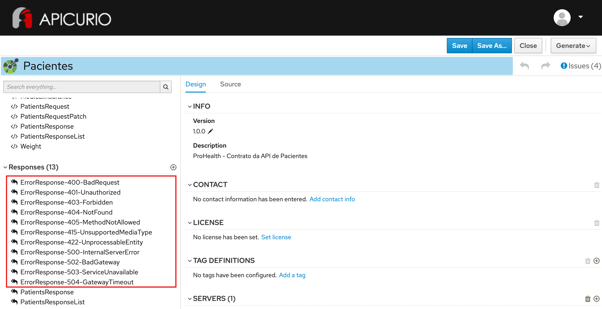

# Exercício - Responses de erro

1 - Abra a ferramenta:
https://www.apicur.io/apicurito/

2 - Clique em "Try Live"

3 - Na próxima tela, clique em "Open API"
 
4 - Abra o conteúdo do arquivo [pacientes-openapi-spec.json](pacientes-openapi-spec.json)

5 - As telas apresentadas devem corresponder a essas:



## Passo a Passo:

A partir do OpenAPI gerado no exercício anterior:

### Etapa 1 - Criação dos responses de erro

#### 400 - Bad Gateway
* Na parte esquerda da tela, na seção Responses, clique no íconoe `+`
* No campo Name, preencha: `ErrorResponse-400-BadRequest`
* No campo Description, preencha: `Mensagem de erro a ser retornada no body do response (400-BadRequest)`
* Clique em Add a media type e mantenha a seleção `application/json` - add
* Clique em No Type - Selecione `ErrorMessage`
* Clique em No examples defined - em seguida, Add an example
* No campo Name, preencha: `BadRequestExample`
* No campo abaixo:
```
{
  "issue" : "MALFORMED_REQUEST",
  "description": "The request body is not well formed",
  "location" : "body"
}
```

#### 401 - Unauthorized
* Na parte esquerda da tela, na seção Responses, clique no íconoe `+`
* No campo Name, preencha: `ErrorResponse-401-Unauthorized`
* No campo Description, preencha: `Mensagem de erro a ser retornada no body do response (401-Unauthorized)`
* Clique em Add a media type e mantenha a seleção `application/json` - add
* Clique em No Type - Selecione `ErrorMessage`
* Clique em No examples defined - em seguida, Add an example
* No campo Name, preencha: `UnauthorizedExample`
* No campo abaixo:
```
{
  "issue" : "NOT_AUTHORIZED",
  "description": "Authorization failed due to insufficient permissions",
  "location" : "header",
  "field" : "Authorization"
}
```

#### 403 - Forbidden
* Na parte esquerda da tela, na seção Responses, clique no íconoe `+`
* No campo Name, preencha: `ErrorResponse-403-Forbidden`
* No campo Description, preencha: `Mensagem de erro a ser retornada no body do response (403-Forbidden)`
* Clique em Add a media type e mantenha a seleção `application/json` - add
* Clique em No Type - Selecione `ErrorMessage`
* Clique em No examples defined - em seguida, Add an example
* No campo Name, preencha: `ForbiddenExample`
* No campo abaixo:
```
{
  "issue" : "PERMISSION_DENIED",
  "description": "You do not have permission to access or perform operations on this resource",
  "location" : "header",
  "field" : "Authorization"
}
```

#### 404 - Not Found
* Na parte esquerda da tela, na seção Responses, clique no íconoe `+`
* No campo Name, preencha: `ErrorResponse-404-NotFound`
* No campo Description, preencha: `Mensagem de erro a ser retornada no body do response (404-Not Found)`
* Clique em Add a media type e mantenha a seleção `application/json` - add
* Clique em No Type - Selecione `ErrorMessage`
* Clique em No examples defined - em seguida, Add an example
* No campo Name, preencha: `NotFoundExample`
* No campo abaixo:
```
{
  "issue" : "INVALID_RESOURCE_ID",
  "description": "Specified resource ID does not exist",
  "location" : "path_parameter",
  "field" : "id",
  "value" : "X"
}
```

#### 405 - Method Not Allowed
* Na parte esquerda da tela, na seção Responses, clique no íconoe `+`
* No campo Name, preencha: `ErrorResponse-405-MethodNotAllowed`
* No campo Description, preencha: `Mensagem de erro a ser retornada no body do response (405-Method Not Allowed)`
* Clique em Add a media type e mantenha a seleção `application/json` - add
* Clique em No Type - Selecione `ErrorMessage`
* Clique em No examples defined - em seguida, Add an example
* No campo Name, preencha: `MethodNotAllowedExample`
* No campo abaixo:
```
{
  "issue" : "METHOD_NOT_SUPPORTED",
  "description": "Invalid path and HTTP method combination"
}
```

#### 415 - Unsupported Media Type
* Na parte esquerda da tela, na seção Responses, clique no íconoe `+`
* No campo Name, preencha: `ErrorResponse-415-UnsupportedMediaType`
* No campo Description, preencha: `Mensagem de erro a ser retornada no body do response (415-Unsupported Media Type)`
* Clique em Add a media type e mantenha a seleção `application/json` - add
* Clique em No Type - Selecione `ErrorMessage`
* Clique em No examples defined - em seguida, Add an example
* No campo Name, preencha: `UnsupportedMediaTypeExample`
* No campo abaixo:
```
{
  "issue" : "INVALID_CONTENT_TYPE",
  "description": "The specified Content Type header is invalid"
}
```

#### 422 - Unprocessable Entity
* Na parte esquerda da tela, na seção Responses, clique no íconoe `+`
* No campo Name, preencha: `ErrorResponse-422-UnprocessableEntity`
* No campo Description, preencha: `Mensagem de erro a ser retornada no body do response (422-Unprocessable Entity)`
* Clique em Add a media type e mantenha a seleção `application/json` - add
* Clique em No Type - Selecione `ErrorMessage`
* Clique em No examples defined - em seguida, Add an example
* No campo Name, preencha: `UnprocessableEntityExample`
* No campo abaixo:
```
{
  "issue" : "INVALID_PARAMETER_VALUE",
  "description": "Field value is invalid",
  "location" : "body",
  "field" : "cpf",
  "value" : "000.000.000-00"
}
```

#### 500 - Internal Server Error
* Na parte esquerda da tela, na seção Responses, clique no íconoe `+`
* No campo Name, preencha: `ErrorResponse-500-InternalServerError`
* No campo Description, preencha: `Mensagem de erro a ser retornada no body do response (500-Internal Server Error)`
* Clique em Add a media type e mantenha a seleção `application/json` - add
* Clique em No Type - Selecione `ErrorMessage`
* Clique em No examples defined - em seguida, Add an example
* No campo Name, preencha: `InternalServerErrorExample`
* No campo abaixo:
```
{
  "issue" : "INTERNAL_SERVER_ERROR",
  "description": "A system or application error occurred"
}
```

#### 502 - Bad Gateway
* Na parte esquerda da tela, na seção Responses, clique no íconoe `+`
* No campo Name, preencha: `ErrorResponse-502-BadGateway`
* No campo Description, preencha: `Mensagem de erro a ser retornada no body do response (502-Bad Gateway)`
* Clique em Add a media type e mantenha a seleção `application/json` - add
* Clique em No Type - Selecione `ErrorMessage`
* Clique em No examples defined - em seguida, Add an example
* No campo Name, preencha: `BadGatewayExample`
* No campo abaixo:
```
{
  "issue" : "BAD_GATEWAY",
  "description": "The server returned an invalid response"
}
```

#### 503 - Service Unavailable
* Na parte esquerda da tela, na seção Responses, clique no íconoe `+`
* No campo Name, preencha: `ErrorResponse-503-ServiceUnavailable`
* No campo Description, preencha: `Mensagem de erro a ser retornada no body do response (503-Service Unavailable)`
* Clique em Add a media type e mantenha a seleção `application/json` - add
* Clique em No Type - Selecione `ErrorMessage`
* Clique em No examples defined - em seguida, Add an example
* No campo Name, preencha: `ServiceUnavailableExample`
* No campo abaixo:
```
{
  "issue" : "SERVICE_UNAVAILABLE",
  "description": "The server cannot handle the request for a service due to temporary maintenance"
}
```

#### 504 - Gateway Timeout
* Na parte esquerda da tela, na seção Responses, clique no íconoe `+`
* No campo Name, preencha: `ErrorResponse-504-GatewayTimeout`
* No campo Description, preencha: `Mensagem de erro a ser retornada no body do response (504-Gateway Timeout)`
* Clique em Add a media type e mantenha a seleção `application/json` - add
* Clique em No Type - Selecione `ErrorMessage`
* Clique em No examples defined - em seguida, Add an example
* No campo Name, preencha: `GatewayTimeoutExample`
* No campo abaixo:
```
{
  "issue" : "GATEWAY_TIMEOUT",
  "description": "The server did not send the response in the expected time"
}
```

### Etapa 2 - Configuração do responses de erro 405 para operações não-permitidas

Siga o procedimento abaixo para as operações seguintes:
```
PUT /patients
PATCH /patients
DELETE /patients
POST /patients/{id}
```

* Na parte esquerda da tela, na seção PATHS, clique no path da operação: /patients ou /patients/{id}
* Na parte direita da tela, clique no verbo
* Na seção RESPONSES, clique no botão `+`
* Selecione o Response Status Code `405 Method Not Allowed` e clique em `Add`
* Preencha o campo Description: `Response para erro 405 - Method Not Allowed`
* No campo Response Body, clique em `Add a media type`
* Mantenha a opção `application/json` selecionada e clique em `Add`
* Clique em `No Type` - selecione o Type `ErrorMessage`
* Clique em `No example` - em seguida em `Add a example`
* Preencha o campo `Name` com o nome do exemplo: `MethodNotAllowedExample`

```
{
  "issue" : "METHOD_NOT_SUPPORTED",
  "description": "Invalid path and HTTP method combination"
}
```