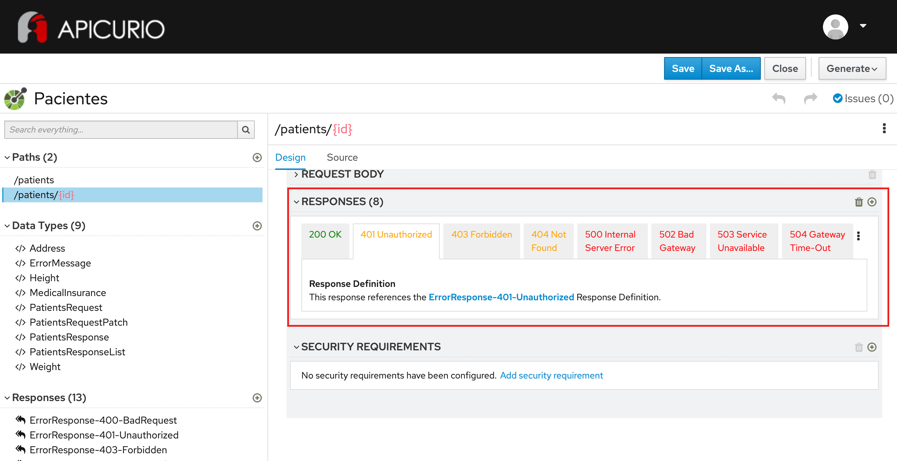

# Exercício - Responses de erro

1 - Abra a ferramenta:
https://www.apicur.io/apicurito/

2 - Clique em "Try Live"

3 - Na próxima tela, clique em "Open API"
 
4 - Abra o conteúdo do arquivo [pacientes-openapi-spec.json](pacientes-openapi-spec.json)

5 - A tela apresentada deve corresponder a essa:



## Passo a Passo:

A partir do OpenAPI gerado no exercício anterior:

### Etapa 1 - Configuração do responses de erro 405 para operações não-permitidas

Siga o procedimento abaixo para as operações seguintes:
```
PUT /patients
PATCH /patients
DELETE /patients
POST /patients/{id}
```

* Na parte esquerda da tela, na seção PATHS, clique no path da operação: /patients ou /patients/{id}
* Na parte direita da tela, clique no verbo
* Na seção RESPONSES, clique no botão `+`
* Selecione o Response Status Code `405 Method Not Allowed`
* Selecione o Response Definition `ErrorResponse-405-MethodNotAllowed` - clique em `Add`


### Etapa 2 - Configuração do response de erro para demais operações

Criar responses a partir das rotas:

#### 400 Bad Request
* Aplicar à:
  * POST /patients
  * PUT /patients/{id}
  * PATCH /patients/{id}
* Response Status Code: `400 Bad Request`
* Selecione o Response Definition `ErrorResponse-400-BadRequest` - clique em `Add`

#### 401 - Unauthorized
* Aplicar à:
  * GET /patients
  * POST /patients
  * GET /patients/{id}
  * PUT /patients/{id}
  * PATCH /patients/{id}
  * DELETE /patients/{id}
* Response Status Code: `401 - Unauthorized`
* Selecione o Response Definition `ErrorResponse-401-Unauthorized` - clique em `Add`

#### 403 - Forbidden
* Aplicar à:
  * GET /patients
  * POST /patients
  * GET /patients/{id}
  * PUT /patients/{id}
  * PATCH /patients/{id}
  * DELETE /patients/{id}
* Response Status Code: `403 - Forbidden`
* Selecione o Response Definition `ErrorResponse-403-Forbidden` - clique em `Add`

#### 404 - Not Found
* Aplicar à:
  * GET /patients
  * GET /patients/{id}
  * PUT /patients/{id}
  * PATCH /patients/{id}
  * DELETE /patients/{id}
* Response Status Code: `404 - Not Found`
* Selecione o Response Definition `ErrorResponse-404-NotFound` - clique em `Add`

#### 415 - Unsupported Media Type
* Aplicar à:
  * POST /patients
  * PUT /patients/{id}
  * PATCH /patients/{id}
* Response Status Code: `415 - Unsupported Media Type`
* Selecione o Response Definition `ErrorResponse-415-UnsupportedMediaType` - clique em `Add`

#### 422 - Unprocessable Entity
* Aplicar à:
  * POST /patients
  * PUT /patients/{id}
  * PATCH /patients/{id}
* Response Status Code: `422 - Unprocessable Entity`
* Selecione o Response Definition `ErrorResponse-422-UnprocessableEntity` - clique em `Add`

#### 500 - Internal Server Error
* Aplicar à:
  * GET /patients
  * POST /patients
  * GET /patients/{id}
  * PUT /patients/{id}
  * PATCH /patients/{id}
  * DELETE /patients/{id}
* Response Status Code: `500 - Internal Server Error`
* Selecione o Response Definition `ErrorResponse-500-InternalServerError` - clique em `Add`

#### 502 - Bad Gateway
* Aplicar à:
  * GET /patients
  * POST /patients
  * GET /patients/{id}
  * PUT /patients/{id}
  * PATCH /patients/{id}
  * DELETE /patients/{id}
* Response Status Code: `502 - Bad Gateway`
* Selecione o Response Definition `ErrorResponse-502-BadGateway` - clique em `Add`

#### 503 - Service Unavailable
* Aplicar à:
  * GET /patients
  * POST /patients
  * GET /patients/{id}
  * PUT /patients/{id}
  * PATCH /patients/{id}
  * DELETE /patients/{id}
* Response Status Code: `503 - Service Unavailable`
* Selecione o Response Definition `ErrorResponse-503-ServiceUnavailable` - clique em `Add`

#### 504 - Gateway Timeout
* Aplicar à:
  * GET /patients
  * POST /patients
  * GET /patients/{id}
  * PUT /patients/{id}
  * PATCH /patients/{id}
  * DELETE /patients/{id}
* Response Status Code: `504 - Gateway Timeout`
* Selecione o Response Definition `ErrorResponse-504-GatewayTimeout` - clique em `Add`