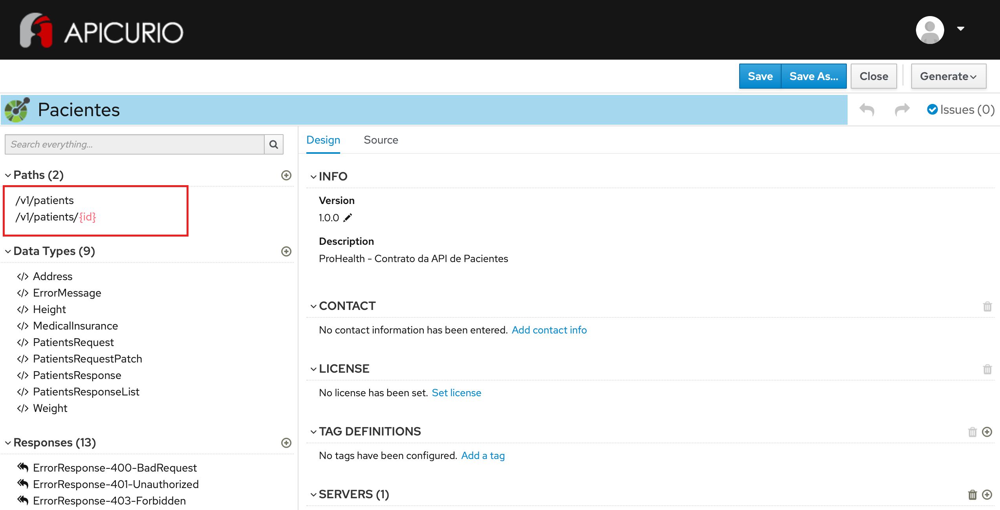

# Exercício - Versionamento por path

1 - Abra a ferramenta:
https://www.apicur.io/apicurito/

2 - Clique em "Try Live"

3 - Na próxima tela, clique em "Open API"
 
4 - Abra o conteúdo do arquivo [pacientes-openapi-spec.json](pacientes-openapi-spec.json)

5 - As telas apresentadas devem corresponder a essas:

## Passo a Passo:

A partir do OpenAPI gerado no exercício anterior:

### Etapa 1 - Configuração de versão nos paths existentes

* Na parte à esquerda da tela, na seção Paths, clique com o botão direito em `/patients` - Rename
* No campo Path altere o valor para: `/v1/patients`
* Mantenha selecionada a opção `Also rename 1 sub-path(s).`
* Clique no botão `Rename`