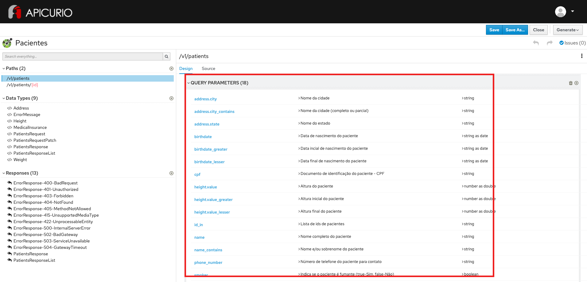

# Exercício - Filtros

## Preview do resultado final:

1 - Abra a ferramenta:
https://www.apicur.io/apicurito/

2 - Clique em "Try Live"

3 - Na próxima tela, clique em "Open API"
 
4 - Abra o conteúdo do arquivo [pacientes-openapi-spec.json](pacientes-openapi-spec.json)

5 - A tela apresentada deve corresponder a essa:

## Passo a Passo:

A partir do OpenAPI gerado no exercício anterior:

### Etapa 1 - Configuração de filtros para coleção de pacientes

* Na parte esquerda da tela, na seção Paths, clique em `/v1/patients`
* Na parte direita da tela, confirme a seleção do verbo `Get`
* Na seção QUERY PARAMETERS, para cada um dos campos abaixo:
* Clique no botão `+` e preencha:

Name | Description | Type Information
-----|-------------|-----------------
id_in | Lista de ids de pacientes | Not required | String as String
name | Nome completo do paciente | Not Required | String as String
name_contains | Nome e/ou sobrenome do paciente  | Not Required | String as String
cpf | Documento de identificação do paciente - CPF | Not Required | String as String
phone_number | Número de telefone do paciente para contato | Not Required | String as String
birthdate | Data de nascimento do paciente | Not Required | String as Date
birthdate_greater | Data incial de nascimento do paciente | Not Required | String as Date
birthdate_lesser | Data final de nascimento do paciente | Not Required | String as Date
smoker | Indica se o paciente é fumante (true-Sim, false-Não) | Not Required | Boolean