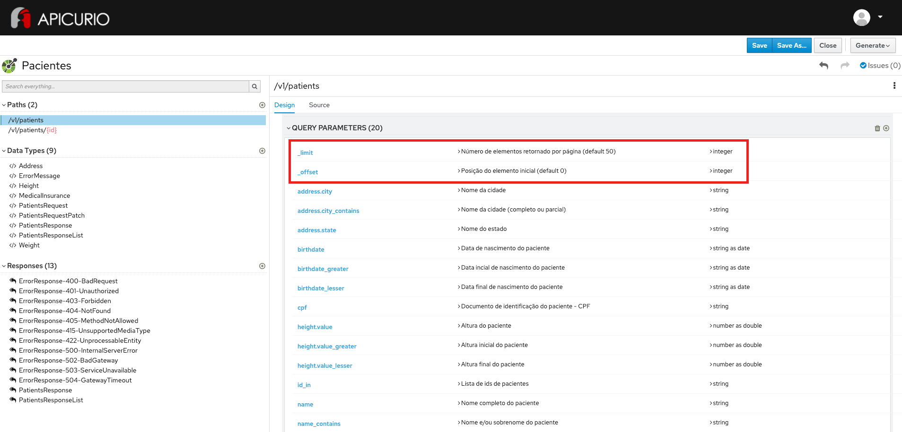

# Exercício - Paginação

## Preview do resultado final:

1 - Abra a ferramenta:
https://www.apicur.io/apicurito/

2 - Clique em "Try Live"

3 - Na próxima tela, clique em "Open API"
 
4 - Abra o conteúdo do arquivo [pacientes-openapi-spec.json](pacientes-openapi-spec.json)

5 - A tela apresentada deve corresponder a essa:

## Passo a Passo:

A partir do OpenAPI gerado no exercício anterior:

### Etapa 1 - Configuração de parâmetros de paginação para coleção de pacientes

* Na parte esquerda da tela, na seção Paths, clique em `/patients`
* Na parte direita da tela, confirme a seleção do verbo `Get`
* Na seção QUERY PARAMETERS, para cada um dos campos abaixo:
* Clique no botão `+` e preencha:

Name | Description | Type Information
-----|-------------|-----------------
_limit | Número de elementos retornado por página (default 50) | Not Required | Integer as Integer
_offset | Posição do elemento inicial (default 0) | Not Required | Integer as Integer
