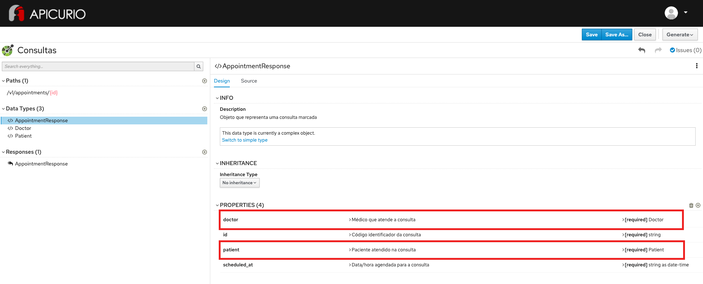

# Exercício - Associação por atributos

## Preview do resultado final:

1 - Abra a ferramenta:
https://www.apicur.io/apicurito/

2 - Clique em "Try Live"

3 - Na próxima tela, clique em "Open API"
 
4 - Abra o conteúdo do arquivo [consultas-openapi-spec.json](consultas-openapi-spec.json)

5 - A tela apresentada deve corresponder a essa:



## Passo a Passo:

### Etapa 1 - Criação do OpenAPI (Consultas)

1 - Abra a ferramenta:
https://www.apicur.io/apicurito/

2 - Clique em "Try Live"

3 - Na próxima tela, clique em "New API"

4 - Na tela principal:
* Na parte superior da tela, clique no lápis ao lado da palavra "New API" e digite o nome da entidade de negócio:
````
Consultas
````

* No lado direito da tela, a partir da seção INFO, clique no valor do campo "Description" e fale do que se trata o seu contrato:
````
ProHealth - Contrato da API de consultas médicas
````

* Na seção SERVERS, clique em Add a server
    * No campo Server URL, preencha com: http://localhost:8080 - clique em Apply - clique em Save

### Etapa 2 - Criação do Data Type Patient

Na parte à esquerda da tela, na seção Data Types, no botão `+`
* Em 1. Enter Basic Information, preencha no campo Name: `Patient`
* Em description, preencha: `Objeto que representa um paciente da clínica`
* Em 2. Enter JSON Example, preencha:
```
{
    "id": "3dc97efc-1b5b-492c-905c-449677b390e1",
    "name": "Marcio Andrade",
    "cpf": "123.345.789-0",
    "phone_number": "11-91111-4394"
}
```
* Em 3. Choose to create a REST Resource with the Data Type, mantenha a opção `No Resource`

Na parte à direita da tela, na seção PROPERTIES:
* Repita os passos para cada item da tabela abaixo:
* Preencha os campos Descriptions, Obrigatoriedade e Tipo

Nome | Descrição | Obrigatoriedade | Tipo
------|--------|--------|--------
cpf | Documento de identificação do paciente - CPF | Required | String as String
id | Código identificador do paciente | Required | String as String
name | Nome completo do paciente | Required | String as String
phone_number | Número de telefone do paciente | Required | String as String

### Etapa 3 - Criação do Data Type Doctor

Na parte à esquerda da tela, na seção Data Types, clique no botão `+`
* Em 1. Enter Basic Information, preencha no campo Name: `Doctor`
* Em description, preencha: `Objeto que representa um médico da clínica`
* Em 2. Enter JSON Example, preencha:
```
{
    "id": "44ce5e16-0acf-4b21-91aa-f8610f247cbb",
    "name": "José Eduardo Sousa",
    "crm": "008.321.111-0",
    "phone_number": "(11)92222-5501"
}
```
* Em 3. Choose to create a REST Resource with the Data Type, mantenha a opção `No Resource`

Na parte à direita da tela, na seção PROPERTIES:
* Repita os passos para cada item da tabela abaixo:
* Preencha os campos Descriptions, Obrigatoriedade e Tipo

Nome | Descrição | Obrigatoriedade | Tipo
------|--------|--------|--------
crm | Registro no Conselho Regional de Medicina | Required | String as String
id | Código identificador do médico | Required | String as String
name | Nome completo do médico | Required | String as String
phone_number | Número de telefone do médico | Required | String as String


### Etapa 4 - Criação do Data Type AppointmentResponse

Na parte à esquerda da tela, na seção Data Types, clique no botão `+`
* Em 1. Enter Basic Information, preencha no campo Name: `AppointmentResponse`
* Em description, preencha: `Objeto que representa uma consulta marcada`
* Em 2. Enter JSON Example, preencha:
```
{
    "id": "ba20f18f-4797-4e39-8502-e63be9929b96",
    "scheduled_at": "2020-12-23T07:23:00Z",
    "patient": {
        "id": "3dc97efc-1b5b-492c-905c-449677b390e1",
        "name": "Marcio Andrade",
        "cpf": "123.345.789-0",
        "phone_number": "11-91111-4394"
    },
    "doctor": {
        "id": "44ce5e16-0acf-4b21-91aa-f8610f247cbb",
        "name": "José Eduardo Sousa",
        "crm": "008.321.111-0",
        "phone_number": "(11)92222-5501"
    }
}
```
* Em 3. Choose to create a REST Resource with the Data Type, mantenha a opção `No Resource`

Na parte à direita da tela, na seção PROPERTIES:
* Repita os passos para cada item da tabela abaixo:
* Preencha os campos Descriptions, Obrigatoriedade e Tipo

Nome | Descrição | Obrigatoriedade | Tipo
------|--------|--------|--------
doctor | Médico que atende a consulta | Required | Doctor
id | Código identificador da consulta | Required | String as String
patient | Paciente atendido na consulta | Required | Patient
scheduled_at | Data/hora agendada para a consulta | Required | String as DateTime


### Etapa 5 - Criação do Response

Na parte à esquerda da tela, na seção Responses, clique no botão `+`
* Em 1. Enter Basic Information, preencha no campo Name: `AppointmentResponse`
* Em description, preencha: `Entidade de consulta médica retornada no response`
* Clique no botão `Save`
* Com o `AppointmentResponse` selecionado, no grupo design - Response Body, clique no link `Add a media type`
* Certifique-se que `application/json` esteja selecionado - clique no botão `add`
* Clique em `No Type` -> `Choose Type` -> `AppointmentResponse`
* Clique em `No examples defined` -> `Add an example`
* No campo Name preencha: `AppointmentExample`. No campo abaixo preencha:
```
{
    "id": "ba20f18f-4797-4e39-8502-e63be9929b96",
    "scheduled_at": "2020-12-23T07:23:00Z",
    "patient": {
        "id": "3dc97efc-1b5b-492c-905c-449677b390e1",
        "name": "Marcio Andrade",
        "cpf": "123.345.789-0",
        "phone_number": "11-91111-4394"
    },
    "doctor": {
        "id": "44ce5e16-0acf-4b21-91aa-f8610f247cbb",
        "name": "José Eduardo Sousa",
        "crm": "008.321.111-0",
        "phone_number": "(11)92222-5501"
    }
}
```


### Etapa 6 - Criação da rota de consultas médicas

Na parte à esquerda da tela, na seção Paths, clique no botão `+`
* No campo Path, preencha: `/v1/appointments/{id}` - clique no botão `Add`
* Na seção INFO, no campo Summary, preencha: `Rota de consultas médicos`
* Na seção INFO, no campo Descrition, preencha: `Este recurso é a representação da lista de consultas médicos da clínica`
* Na seção PATH PARAMETERS, clique no botão `+ Create` à direita da tela
* Clique em `No description`: `Campo identificador da consulta médico`
* Clique em `No Type` - `Type`: `String`


### Etapa 7 - Definição de verbo GET para a consulta médica

A partir da rota `/v1/appointments/{id}`:

* Na seção OPERATIONS:

* Get -> Add Operation
    Seção INFO:
    Summary: ```Operação de Consultas médicas```
    Description: ```Operação utilizada para obter uma consulta médica marcada```

    Seção RESPONSES:
    Clique em `Add a response` -> 200 OK
    Em Response Definition (optional) -> `AppointmentResponse` -> Add