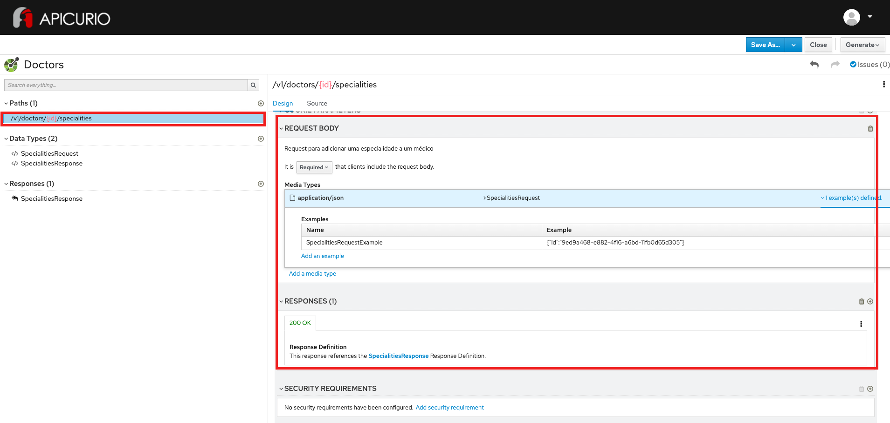

# Exercício - Associação por recursos

1 - Abra a ferramenta:
https://www.apicur.io/apicurito/

2 - Clique em "Try Live"

3 - Na próxima tela, clique em "Open API"
 
4 - Abra o conteúdo do arquivo [doctors-openapi-spec.json](doctors-openapi-spec.json)

5 - A tela apresentada deve corresponder a essa:



## Passo a Passo:

### Etapa 1 - Criação do Data Type Specialities - Request

Na parte à esquerda da tela, na seção Data Types, clique no botão `+`
* Em 1. Enter Basic Information, preencha no campo Name: `SpecialitiesRequest`
* Em description, preencha: `Objeto que representa o código de uma especialidade médica`
* Em 2. Enter JSON Example, preencha:
```
{
    "id": "50"
}
```
* Em 3. Choose to create a REST Resource with the Data Type, mantenha a opção `No Resource`
* Clique no botão `Save`

Na parte à direita da tela, na seção PROPERTIES:
* Preencha os campos Description, Obrigatoriedade e Tipo

Nome | Descrição | Obrigatoriedade | Tipo
------|--------|--------|--------
id | Código da especialidade médica | Required | String as String

### Etapa 2 - Criação do Data Type Specialities - Response

Na parte à esquerda da tela, na seção Data Types, clique no botão `+`
* Em 1. Enter Basic Information, preencha no campo Name: `SpecialitiesResponse`
* Em description, preencha: `Objeto que representa uma especialidade médica`
* Em 2. Enter JSON Example, preencha:
```
{
    "id": "50",
    "name": "Cardiologia",
    "description": "Cardiologia é a especialidade médica que se ocupa do diagnóstico e tratamento das doenças que acometem o coração bem como os outros componentes do sistema circulatório"
}
```
* Em 3. Choose to create a REST Resource with the Data Type, mantenha a opção `No Resource`
* Clique no botão `Save`

Na parte à direita da tela, na seção PROPERTIES:
* Repita os passos para cada item da tabela abaixo:
* Preencha os campos Description, Obrigatoriedade e Tipo

Nome | Descrição | Obrigatoriedade | Tipo
------|--------|--------|--------
description | Descrição da especialidade médica | Required | String as String
id | Código da especialidade médica | Required | String as String
name | Nome da especialidade médica | Required | String as String

### Etapa 3 - Criação do Response

Na parte à esquerda da tela, na seção Responses, clique no botão `+`
* Em 1. Enter Basic Information, preencha no campo Name: `SpecialitiesResponse`
* Em description, preencha: `Entidade de especialidade médica retornada no response`
* Clique no botão `Save`
* Com o SpecialitiesResponse selecionado, no grupo design - Response Body, clique no link `Add a media type`
* Certifique-se que `application/json` esteja selecionado - clique no botão `add`
* Clique em `No Type` -> `Choose Type` -> `SpecialitiesResponse`
* Clique em `No examples defined` -> `Add an example`
* No campo Name preencha: `SpecialitiesExample`. No campo abaixo preencha:
```
{
    "id": "50",
    "name": "Cardiologia",
    "description": "Cardiologia é a especialidade médica que se ocupa do diagnóstico e tratamento das doenças que acometem o coração bem como os outros componentes do sistema circulatório"
}
```

### Etapa 4 - Criação da rota de consulta de especialidades

Na parte à esquerda da tela, na seção Paths, clique no botão `+`
* No campo Path, preencha: `/v1/doctors/{id}/specialities` - clique no botão `Add`
* Na seção INFO, no campo Summary, preencha: `Rota de consulta das especialidades de um médico`
* Na seção INFO, no campo Descrition, preencha: `Este recurso é a representação da lista de especialidades de um determinado médico da clínica`
* Na seção PATH PARAMETERS, clique no botão `+ Create` à direita da tela
* Clique em `No description`: `Campo identificador do Médico`
* Clique em `No Type` - `Type`: `String`

### Etapa 5 - Definição de verbos para a consulta de especialidades

A partir da rota `/v1/doctors/{id}/specialities`:

* Na seção OPERATIONS:

* Get -> Add Operation
    Seção INFO:
    Summary: ```Consulta de especialidades médicas```
    Description: ```Operação utilizada para consultar todos as especialides de um médico```

    Seção RESPONSES:
    Clique em `Add a response` -> 200 OK
    Description: `Response para consulta das especialidades de um médico`
    Clique em `Add a media type` -> `application/json` -> add
    Clique em `No Type` -> Type: SpecialitiesResponse
    Clique em `No examples defined` -> `Add an example` -> Name: `SpecialitiesResponseExample`
    ```
    {
        "id": "50",
        "name": "Cardiologia",
        "description": "Cardiologia é a especialidade médica que se ocupa do diagnóstico e tratamento das doenças que acometem o coração bem como os outros componentes do sistema circulatório"
    }
    ```
    Clique em `Add`

* Para os verbos Put, Patch e Delete -> Add Operation

    Na seção RESPONSES, clique no botão `+`
    Selecione o Response Status Code `405 Method Not Allowed` e clique em `Add`
    Preencha o campo Description: `Response para erro 405 - Method Not Allowed`
    No campo Response Body, clique em `Add a media type`
    Mantenha a opção `application/json` selecionada e clique em `Add`
    Clique em `No Type` - selecione o Type `ErrorMessage`
    Clique em `No example` - em seguida em `Add a example`
    Preencha o campo `Name` com o nome do exemplo: `MethodNotAllowedExample`
    ```
    {
        "issue" : "METHOD_NOT_SUPPORTED",
        "description": "Invalid path and HTTP method combination"
    }
    ```

* Post -> Add Operation
    Seção INFO:
    Summary: ```Adição de especialidade para um médico```
    Description: ```Operação utilizada para associar uma especialidade a um médico```

    Seção REQUEST BODY:
    Clique em `Add a request body`
    Description: `Request para adicionar uma especialidade a um médico`
    It is `Required` that clients include the request body
    Clique em `Add a media type` -> `application/json` -> add
    Clique em `No Type` -> Type: SpecialitiesRequest
    Clique em `No examples defined` -> `Add an example` -> Name: `SpecialitiesRequestExample`
    ```
    {
        "id": "50"
    }
    ```

    Seção RESPONSES:
    Clique em `Add a response` -> 200 OK
    Description: `Response para adição de especialidades a um médico`
    Clique em `Add a media type` -> `application/json` -> add
    Clique em `No Type` -> Type: `SpecialitiesResponse`
    Clique em `No examples defined` -> `Add an example` -> Name: `SpecialitiesResponseExample`
    ```
    {
        "id": "50",
        "name": "Cardiologia",
        "description": "Cardiologia é a especialidade médica que se ocupa do diagnóstico e tratamento das doenças que acometem o coração bem como os outros componentes do sistema circulatório"
    }
    ```
    Clique em `Add`    