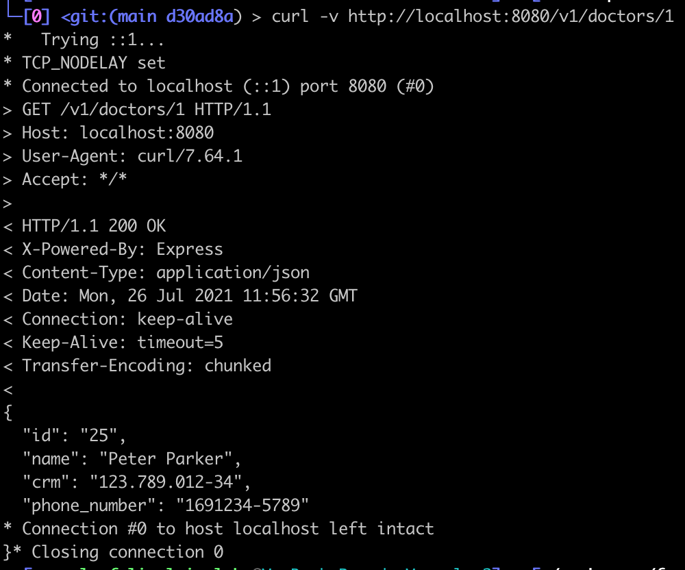

# Exercício - Setup do backend

## Atividade 1 - Baixar a imagem a partir do Docker Hub

- Abra o terminal e execute o comando:
```
docker container run -p 8080:8080 -d --name facef-design-apis-doctors marcelofelixsalgado/facef-design-apis-doctors:latest
```

## Atividade 2 - Testar o funcionamento do backend:

### Opção 1 - A partir do Postman

- Abra o Postman e importe a coleção [Facef-Design-APIs.postman_collection.json](Facef-Design-APIs.postman_collection.json)

- Execute o request a partir de `Facef-Design-APIs / Backend  / Doctors by ID`

- O resultado deve ser:


### Opção 2 - A partir do curl

 A partir do terminal, execute o comando:
```
curl -v http://localhost:8080/v1/doctors/1
```

- O resultado deve ser:

