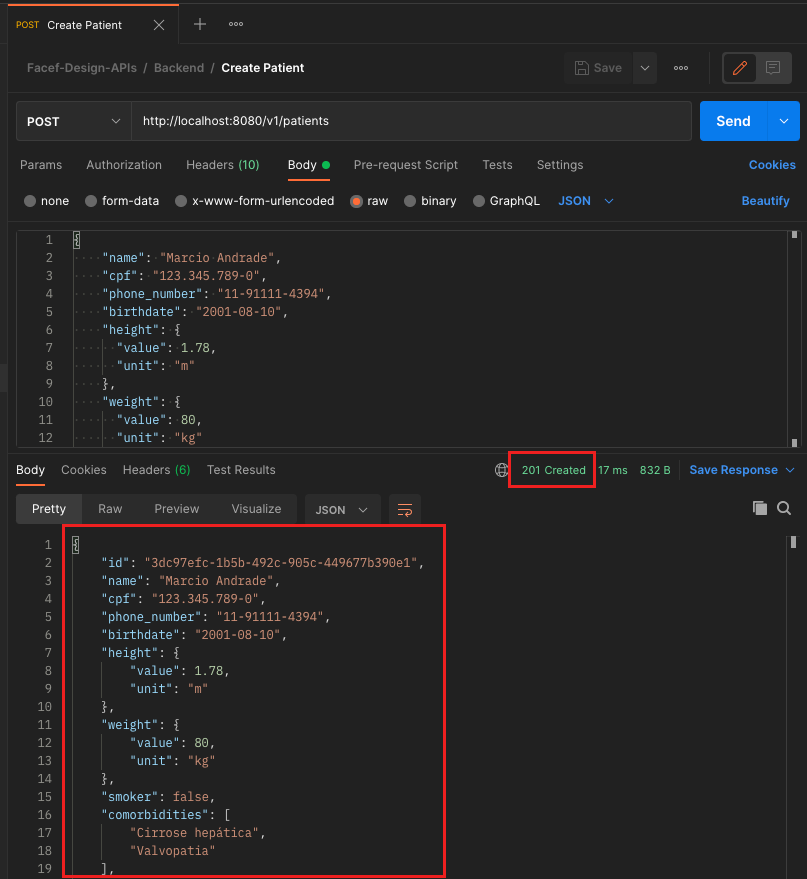

# Exercício - Setup do backend

## Atividade 1 - Baixar a imagem a partir do Docker Hub

- Abra o terminal e execute o comando:
```
docker container run -p 8080:8080 -d --name facef-design-apis-patients marcelofelixsalgado/facef-design-apis-patients:latest
```

## Atividade 2 - Testar o funcionamento do backend:

### Opção 1 - A partir do Postman

- Abra o Postman e importe a coleção [Facef-Design-APIs.postman_collection.json](Facef-Design-APIs.postman_collection.json)

#### Consulta de todos os pacientes
- Execute o request a partir de `Facef-Design-APIs / Backend  / Get Patient list
- O resultado deve ser:


#### Consulta de paciente por ID
- Execute o request a partir de `Facef-Design-APIs / Backend  / Get Patient by ID
- O resultado deve ser:


#### Criação de paciente
- Execute o request a partir de `Facef-Design-APIs / Backend  / Create Patient
- O resultado deve ser:


#### Atualização de paciente
- Execute o request a partir de `Facef-Design-APIs / Backend  / Update Patient
- O resultado deve ser:


#### Exclusão de paciente
- Execute o request a partir de `Facef-Design-APIs / Backend  / Remove Patient
- O resultado deve ser:


### Opção 2 - A partir do curl

#### Consulta de todos os pacientes
A partir do terminal, execute o comando:
```
curl -v 'http://localhost:8080/v1/patients'
```
- O resultado deve ser:


#### Consulta de paciente por ID
A partir do terminal, execute o comando:
```
curl -v 'http://localhost:8080/v1/patients/3dc97efc-1b5b-492c-905c-449677b390e1'
```
- O resultado deve ser:


#### Criação de paciente
A partir do terminal, execute o comando:
```
curl -v --request POST 'http://localhost:8080/v1/patients' \
--header 'Content-Type: application/json' \
--data-raw '{
    "name": "Marcio Andrade",
    "cpf": "123.345.789-0",
    "phone_number": "11-91111-4394",
    "birthdate": "2001-08-10",
    "height": {
      "value": 1.78,
      "unit": "m"
    },
    "weight": {
      "value": 80,
      "unit": "kg"
    },
    "smoker": false,
    "comorbidities": ["Cirrose hepática", "Valvopatia"],
    "medical_insurance": {
        "id": "324.5231100.3432",
        "operator_code": "AMIL"
    },
    "address": {
        "street": "Rua Luis Gois, 1200",
        "complement": "apto 204",
        "district": "Vila Mariana",
        "city": "São Paulo",
        "state": "SP",
        "zipcode": "04043-050"
    }
}'
```
- O resultado deve ser:


#### Atualização de paciente
A partir do terminal, execute o comando:
```
curl -v --request PUT 'http://localhost:8080/v1/patients/3dc97efc-1b5b-492c-905c-449677b390e1' \
--header 'Content-Type: application/json' \
--data-raw '{
    "id": "3dc97efc-1b5b-492c-905c-449677b390e1",
    "name": "Marcio Andrade",
    "cpf": "123.345.789-0",
    "phone_number": "11-91111-4394",
    "birthdate": "2001-08-10",
    "height": {
      "value": 1.78,
      "unit": "m"
    },
    "weight": {
      "value": 80,
      "unit": "kg"
    },
    "smoker": false,
    "comorbidities": ["Cirrose hepática", "Valvopatia"],
    "medical_insurance": {
        "id": "324.5231100.3432",
        "operator_code": "AMIL"
    },
    "address": {
        "street": "Rua Luis Gois, 1200",
        "complement": "apto 204",
        "district": "Vila Mariana",
        "city": "São Paulo",
        "state": "SP",
        "zipcode": "04043-050"
    }
}'
```
- O resultado deve ser:


#### Exclusão de paciente
A partir do terminal, execute o comando:
```
curl -v --request DELETE 'http://localhost:8080/v1/patients/3dc97efc-1b5b-492c-905c-449677b390e1'
```
- O resultado deve ser:
