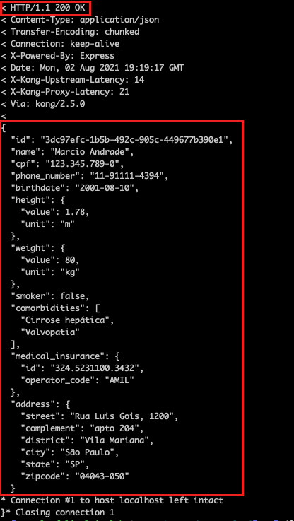

# Exercício 01 - Setup do Kong

Para a execução dessa atividade, espera-se que vc tenha executado previamente a atividade abaixo:
`14-Geracao-de-codigo / 02-Setup-Backend / README.md`

## Atividade 1 - Setup da rede e do gateway

- Abra o terminal

- A partir da pasta `15-API-Gateway / scripts`, execute os comandos :

(Linux ou MacOS):
```
chmod +x ./kong-run.sh
./kong-run.sh setup-network
./kong-run.sh setup-kong
```

(Windows):
```
.\kong-run.bat setup-network
.\kong-run.bat setup-kong
```

## Atividade 2 - Testar o funcionamento da API exposta pelo Kong:

### Opção 1 - A partir do Postman

- Abra o Postman 

- Execute o request a partir de `Facef-Design-APIs / Gateway / 01-Setup-Kong / Get Patient by ID`

- O resultado deve ser:


### Opção 2 - A partir do curl

- A partir do terminal, execute o comando:
```
curl -v GET 'http://localhost:8000/v1/patients/3dc97efc-1b5b-492c-905c-449677b390e1'
```

- O resultado deve ser:

