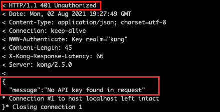
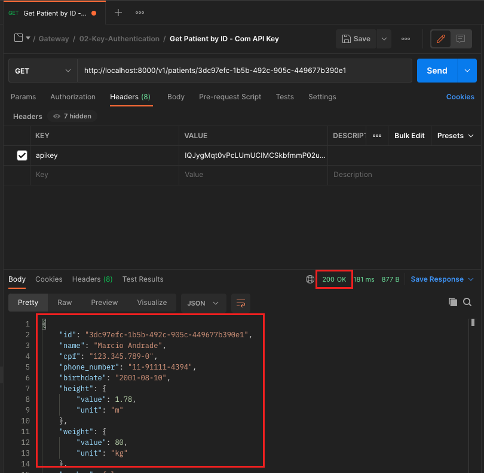

# Exercício 02 - Key Authentication

## Atividade 1 - Atualizar o Declarative Config

- A partir da pasta do declarative config, executar:

(Linux ou MacOS)
```
cp $FACEF_DESIGN_APIS/15-API-Gateway/02-Key-Authentication/kong.yml .
```

(Windows)
```
cp %FACEF_DESIGN_APIS\15-API-Gateway\02-Key-Authentication\kong.yml .
```

## Atividade 2 - Reiniciar o Kong

- Executar no terminal:
```
docker container restart kong
```

## Atividade 2 - Invocar a API sem as credenciais

### Opção 1 - A partir do Postman

- A partir do Postman , executar o request a partir de `Facef-Design-APIs / Kong / 02-Key-Authentication / Doctors by ID - Sem API Key`

- O resultado deve ser:


### Opção 2 - A partir do curl

Invocar a API de consulta de médico
```
curl -v http://localhost:8000/v1/doctors/1
```

O retorno deveria ser:



## Atividade 3 - Obter as credenciais de acesso

### Opção 1 - A partir do Postman
### Opção 2 - A partir do curl

- Invocar a API de consulta de credenciais do Kong:

```
curl -X GET http://localhost:8001/key-auths
```

- Copiar o valor do campo "key"

## Atividade 4 - Invocar a API com as credenciais

### Opção 1 - A partir do Postman

- A partir do Postman , executar o request a partir de `Facef-Design-APIs / Kong / 02-Key-Authentication / Doctors by ID - Com API Key`

- O resultado deve ser:



### Opção 2 - A partir do curl

Invocar a API de consulta de médico, substituindo CHAVE_CONSUMIDOR pela chave obtida na atividade 3
```
curl -v http://localhost:8000/v1/doctors/1 -H 'apikey: CHAVE_CONSUMIDOR'
```
O retorno deveria ser:

