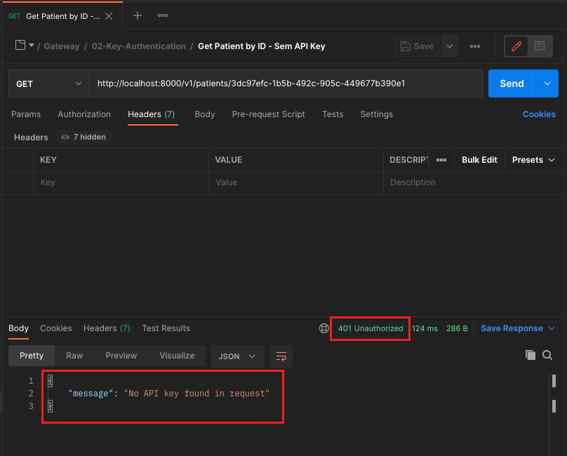

# Exercício 02 - Key Authentication

Para a execução dessa atividade, espera-se que vc tenha executado previamente a atividade abaixo:
`15-API-Gateway / 01-Setup-Kong`

## Atividade 1 - Atualizar o Declarative Config

- Abra o terminal

- A partir da pasta `15-API-Gateway / scripts`, execute os comandos :

(Linux ou MacOS):
```
./kong-run.sh key-auth
```

(Windows):
```
.\kong-run.bat key-auth
```

## Atividade 2 - Invocar a API sem as credenciais

### Opção 1 - A partir do Postman

- A partir do Postman, executar o request a partir de `Facef-Design-APIs / Gateway / 02-Key-Authentication / Get Patient by ID - Sem API Key`

- O resultado deve ser:



### Opção 2 - A partir do curl

Invocar a API de consulta de paciente
```
curl -v GET 'http://localhost:8000/v1/patients/3dc97efc-1b5b-492c-905c-449677b390e1'
```

O retorno deveria ser:


## Atividade 3 - Obter as credenciais de acesso

### Opção 1 - A partir do Postman
- A partir do Postman, executar o request a partir de `Facef-Design-APIs / Gateway / 02-Key-Authentication / Kong key-auths`
- No body do response, copiar o valor do campo "key" - ver figura abaixo:


### Opção 2 - A partir do curl
- Invocar a API de consulta de credenciais do Kong:
```
curl -v http://localhost:8001/key-auths
```
- No body do response, copiar o valor do campo "key" - ver figura abaixo:


## Atividade 4 - Invocar a API com as credenciais

### Opção 1 - A partir do Postman
- A partir do Postman, localize o request `Facef-Design-APIs / Gateway / 02-Key-Authentication / Get Patient by ID - Com API Key`
- Localize o header `apikey` e substitua `CHAVE_CONSUMIDOR` pela chave obtida na atividade 3
- Execute o request
- O resultado deve ser:


### Opção 2 - A partir do curl
- Invocar a API de consulta de paciente, substituindo CHAVE_CONSUMIDOR pela chave obtida na atividade 3
```
curl -v 'http://localhost:8000/v1/patients/3dc97efc-1b5b-492c-905c-449677b390e1' \
--header 'apikey: CHAVE_CONSUMIDOR'
```
- O retorno deveria ser:
