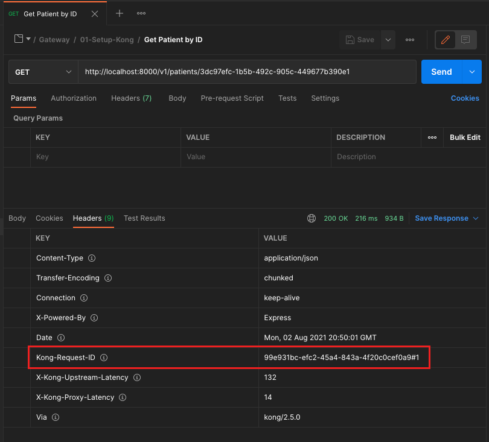

# Exercício 03 - Correlation ID

## Atividade 1 - Atualizar o Declarative Config

- A partir da pasta do declarative config, executar:

(Linux ou MacOS)
```
cp $FACEF_DESIGN_APIS/15-API-Gateway/03-Correlation-ID/kong.yml .
```

(Windows)
```
cp %FACEF_DESIGN_APIS\15-API-Gateway\03-Correlation-ID\kong.yml .
```

## Atividade 2 - Reiniciar o Kong

Executar no terminal:
```
docker container restart kong
```

## Atividade 3 - Testar a chamada da API

### Opção 1 - A partir do Postman

- A partir do Postman , executar o request a partir de `Facef-Design-APIs / Kong / 03-Correlation-ID / Doctors by ID`

- O resultado deve ser:



### Opção 2 - A partir do curl

Invocar a API de consulta de médico:
```
curl -v http://localhost:8000/v1/doctors/1
```

Deve haver um header Kong-Request-ID. Ex:

