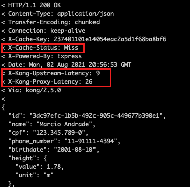
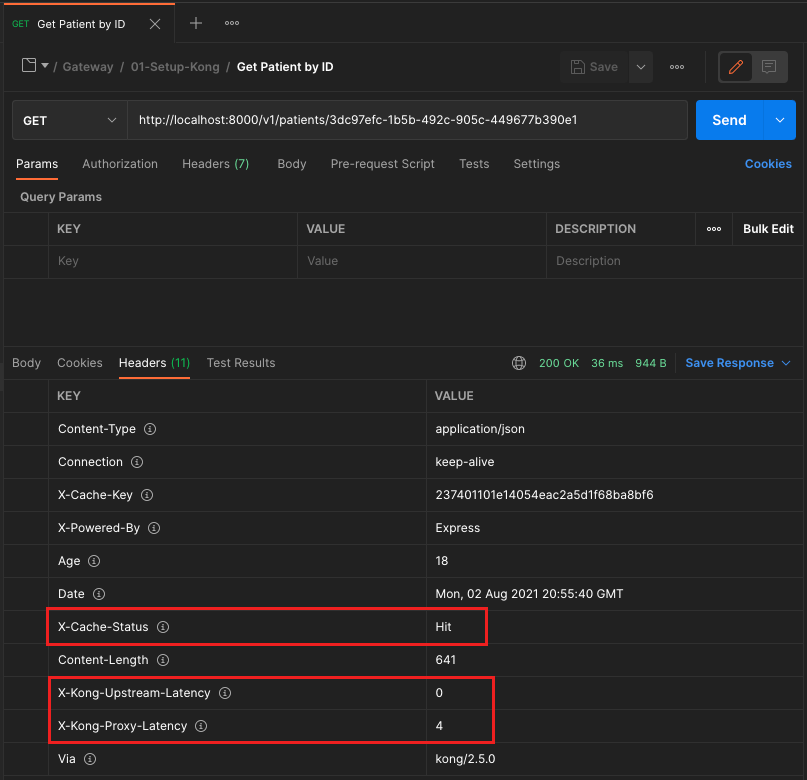

# Exercício 04 - Cache

## Atividade 1 - Atualizar o Declarative Config

- A partir da pasta do declarative config, executar:

(Linux ou MacOS)
```
cp $FACEF_DESIGN_APIS/15-API-Gateway/04-Cache/kong.yml .
```

(Windows)
```
cp %FACEF_DESIGN_APIS\15-API-Gateway\04-Cache\kong.yml .
```

## Atividade 2 - Reiniciar o Kong

Executar no terminal:
```
docker container restart kong
```

## Atividade 3 - Testar a chamada da API sem cache

### Opção 1 - A partir do Postman

- A partir do Postman , executar o request a partir de `Facef-Design-APIs / Gateway / 01-Setup-Kong / Get Patient by ID`

- O resultado deve ser:


### Opção 2 - A partir do curl

- Invocar a API de consulta de paciente (1a chamada - sem cache):
```
curl -v GET 'http://localhost:8000/v1/patients/3dc97efc-1b5b-492c-905c-449677b390e1'
```

- Verifique os três headers na resposta:
    - X-Cache-Status - por não ter reaproveitado do cache, o valor deve ser "Miss"
    - X-Kong-Upstream-Latency - por ser a primeira chamada, o gateway bate no backend - consequentemente a latência é maior que zero
    - X-Kong-Proxy-Latency - a latência de proxy deve ficar por volta de 15 - 40 milissegundos



## Atividade 4 - Testar a chamada da API com cache

### Opção 1 - A partir do Postman

- A partir do Postman , executar o request a partir de `Facef-Design-APIs / Gateway / 01-Setup-Kong / Get Patient by ID`

- O resultado deve ser:



### Opção 2 - A partir do curl

- Invocar a API de consulta de paciente (2a chamada - com cache):
```
curl -v GET 'http://localhost:8000/v1/patients/3dc97efc-1b5b-492c-905c-449677b390e1'
```

- Verifique os três headers na resposta:
    - X-Cache-Status - por ter reaproveitado do cache, o valor deve ser "Hit"
    - X-Kong-Upstream-Latency - por ser a segunda chamada, o gateway não bate no backend - consequentemente a latência é igual a zero
    - X-Kong-Proxy-Latency - a latência de proxy deve ficar abaixo de 20 milissegundos

