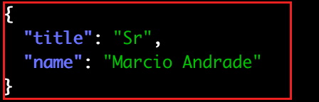

# Exercício 06 - Response Transformer

## Atividade 1 - Consulta antes da transformação do response

### Opção 1 - A partir do Postman

- A partir do Postman , executar o request a partir de `Facef-Design-APIs / Gateway / 01-Setup-Kong / Get Patient by ID`

- O resultado deve ser:


### Opção 2 - A partir do curl

- Invocar a API de consulta de paciente
```
curl 'http://localhost:8000/v1/patients/3dc97efc-1b5b-492c-905c-449677b390e1'
```

- O body do request deve trazer os quatro campos abaixo:


## Atividade 2 - Atualizar o Declarative Config

- A partir da pasta do declarative config, executar:

(Linux ou MacOS)
```
cp $FACEF_DESIGN_APIS/15-API-Gateway/05-Response-Transformer/kong.yml .
```

(Windows)
```
cp %FACEF_DESIGN_APIS\15-API-Gateway\05-Response-Transformerkong.yml .
```

## Atividade 3 - Reiniciar o Kong

Executar no terminal:
```
docker container restart kong
```
## Atividade 4 - Consulta depois da transformação do response

### Opção 1 - A partir do Postman

- A partir do Postman , executar o request a partir de `Facef-Design-APIs / Gateway / 01-Setup-Kong / Get Patient by ID`

- O resultado deve ser:


### Opção 2 - A partir do curl

Invocar a API de consulta de paciente
```
curl 'http://localhost:8000/v1/patients/3dc97efc-1b5b-492c-905c-449677b390e1'
```

O body do request deve trazer um campo novo "title" e sem os campos "crm" e "phone_number":

