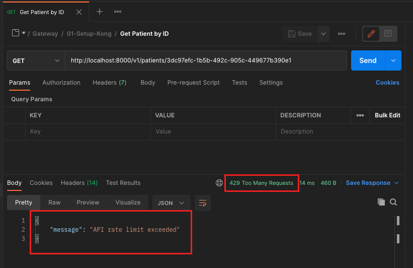
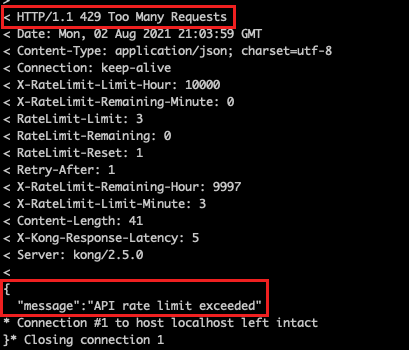

# Exercício 05 - Rate Limiting

Para a execução dessa atividade, espera-se que vc tenha executado previamente a atividade abaixo:
`15-API-Gateway / 01-Setup-Kong`

## Atividade 1 - Atualizar o Declarative Config

- Abra o terminal

- A partir da pasta `15-API-Gateway / scripts`, execute os comandos :

(Linux ou MacOS):
```
./kong-run.sh rate-limiting
```

(Windows):
```
.\kong-run.bat rate-limiting
```

## Atividade 2 - Invocar a API de consulta de paciente 3 vezes seguidas

### Opção 1 - A partir do Postman

- A partir do Postman , executar repetidas vezes o request a partir de `Facef-Design-APIs / Gateway / 01-Setup-Kong / Get Patient by ID`

- A partir da quarta chamada o resultado deve ser:



### Opção 2 - A partir do curl

- Executar o comando abaixo seguidas vezes:

```
curl -v GET 'http://localhost:8000/v1/patients/3dc97efc-1b5b-492c-905c-449677b390e1'
```

- A partir da quarta chamada o resultado deve ser:

